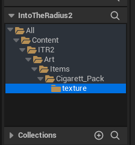
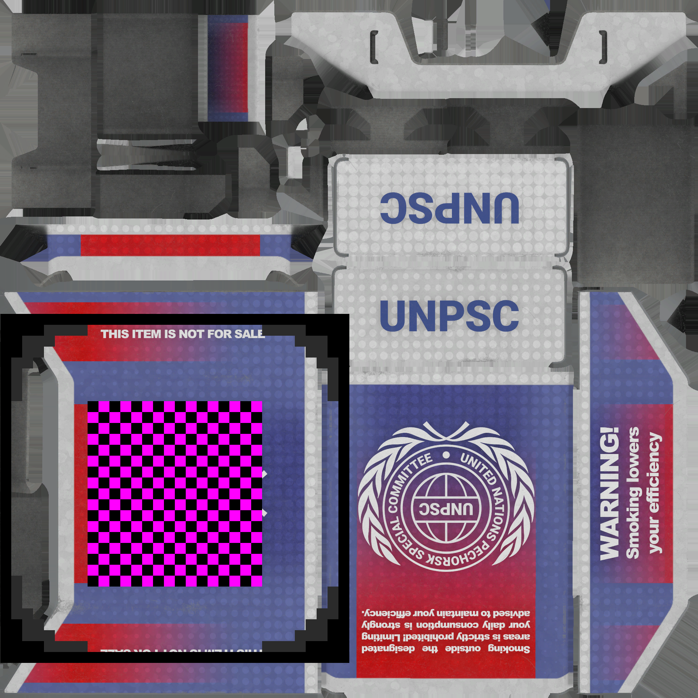
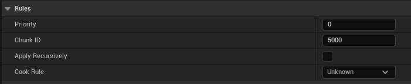
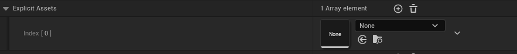
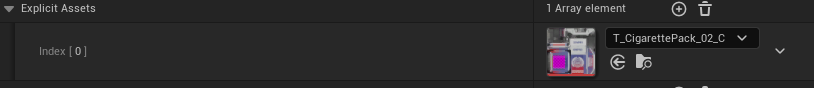
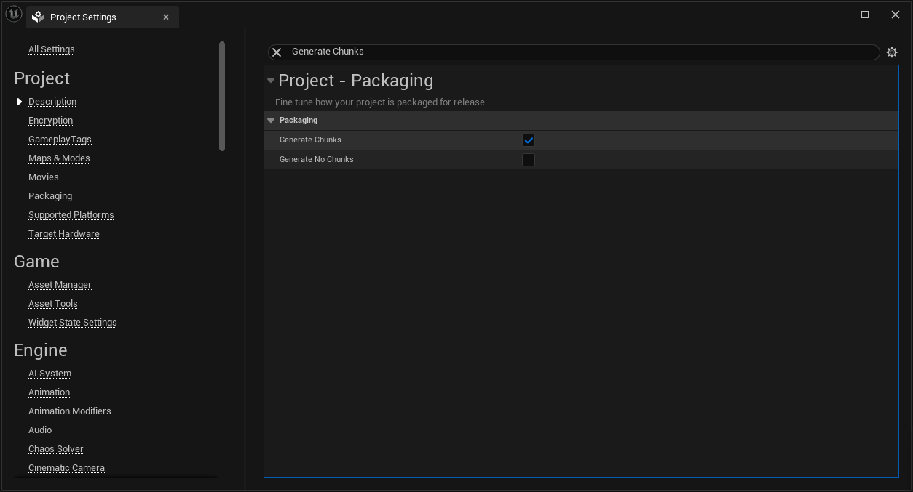
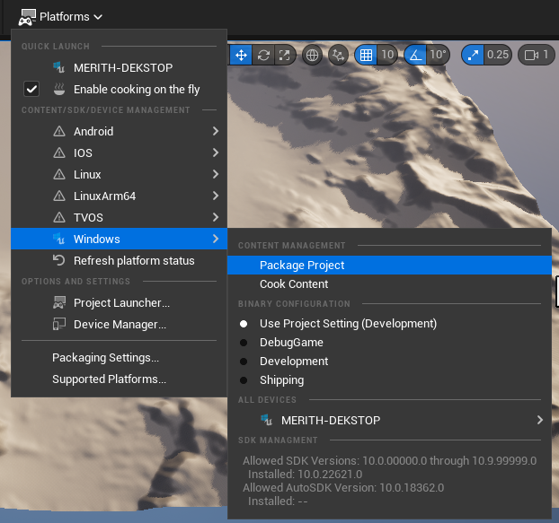

# **Basic Texture Replacement Mod**  

This guide covers the basic steps to replace a texture in *Into the Radius*. It uses the Cigarette Pack texture as an example.

---

## **Instructions**  

This guide is based on personal experience and references from the following resources:  

- [Hunjonzie's Google Doc](https://docs.google.com/document/d/1nSW7Mef1O3LT_IcUiEuMmE0mQw9gL4IF6HEIOEdL_Ek/edit?tab=t.0)  
- [Dmgvol/UE_Modding](https://github.com/Dmgvol/UE_Modding)

### **Step 1: Extract the Texture**  

1. Locate the texture you want to modify using **FModel**.  
   For this example, the Cigarette Pack texture is located at:  

   ```plaintext
   pakchunk0_s3-Windows.utoc/IntoTheRadius2/Content/ITR2/Art/Items/Cigarett_Pack/texture/T_CigarettePack_02_C.uasset
   ```

2. Extract the texture file.  
3. Create the necessary folder structure inside of Unreal Editor:  

   ```
   /Content/ITR2/Art/Items/Cigarett_Pack/texture/
   ```

   Example:  
   

---

### **Step 2: Modify and Replace the Texture**  

1. Edit the extracted texture using an image editor.  
2. Import the modified image into the created folder, ensuring:  
   - It has the **exact same name** as the original (`T_CigarettePack_02_C`).  
   - The file is saved in the correct format.  

**References:**  

- Original texture (unmodified): [.repo-assets/original-asset/](.repo-assets/original-asset/)  
- Example of a modified texture:  
  

---

## **Cooking the Mod**  

This section uses [Dmgvol's Cooking Content Guide](https://github.com/Dmgvol/UE_Modding/blob/main/IntermediateModding/CookingContent.md#cooking-ue5) as a reference.

### **Step 1: Create a Data Asset**  

1. In the Unreal Engine Editor:  
   - Navigate to **Create New > Misc > Data Asset**.  
   - Create the asset in the `Content` folder.  
   - Name it: `Label_modname` (replace `modname` with your mod's name).  
   Example:  
   

2. Configure the Data Asset:  
   - **Priority**: Set to `2`.  
   - **Chunk ID**: Set to `5000`.  
   - **Cook Rule**: Set to `Always Cook`.  
   Example:  
   

3. Add the modified texture:  
   - Under **Explicit Assets**, click `+`.  
   - Drag your modified texture into the box.  
   Example:  
     
   

---

### **Step 2: Enable Chunk Generation**  

1. Go to **Edit > Project Settings**.  
2. Search for **Generate Chunks** in the settings.  
3. Enable it (check the box).  
   Example:  
   

---

## **Mod Packaging**  

### **Step 1: Package the Project**  

1. Package your project using the **File Packaging Tool**.  
   Example:  
     
2. When prompted, choose a folder to save the compiled files.

### **Step 2: Rename the Packaged Files**  

1. Go to the generated folder:  

   ```
   IntoTheRadius2/Content/Paks
   ```

2. Locate the three `pakchunk5000-Windows` files and rename them to:  

   ```
   <modname>_P
   ```

---

## **Creating a Mod Archive**  

- Option 1: Zip the three files directly.  
- Option 2: Use the [Mod Template](https://github.com/ITR-Modding-Community/ITR-Mod-Template):  

   ```
   modname.zip
   └── modname/
       ├── <files>
   ```
