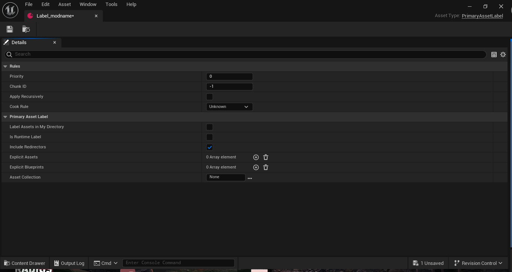

# Basic Texture Replacement

This is a basic texture replacement mod for the Cigarette Pack, specifically to serve as an example.

## Instructions

Based off of my expiriences as well as the following google doc made by `hunjonzie` [Google Doc](https://docs.google.com/document/d/1nSW7Mef1O3LT_IcUiEuMmE0mQw9gL4IF6HEIOEdL_Ek/edit?tab=t.0) and [Dmgvol/UE_Modding](https://github.com/Dmgvol/UE_Modding)

Locate the texture you want to modify, and extract it with fmodel, in my case I am extracting the Cigarette pack texture, located at `pakchunk0_s3-Windows.utoc/IntoTheRadius2/Content/ITR2/Art/Items/Cigarett_Pack/texture/T_CigarettePack_02_C.uasset`
    - This `uproject` is already named correctly so we can skip `IntoTheRadis2/` in the path, 
    - create the structure for `/Content/ITR2/Art/Items/Cigarett_Pack/texture/`
    
    - modify the extracted image
    - import the newly modified image to the folder above, ensuring it is named exactly the same as it is in FModel (in this case, `T_CigarettePack_02_C`)

For reference I have included the original texture (unmodified) in [.repo-assets/original-asset/](.repo-assets/original-asset/), and below is the modified asset I created

## Cooking?

> [Using this Guide as Reference](https://github.com/Dmgvol/UE_Modding/blob/main/IntermediateModding/CookingContent.md#cooking-ue5)

Create a DataAsset (CreateNew > Misc > Data Asset), inside `Content` and name it `Label_modname`, replacing modname with the name of your mod, and then double click it.

We need to configure the data asset so set its Priority to `2`, Chunk ID to `5000`, and the Cook Rule to `Always Cook`

Now we need to add our assets to the Label, under "Explicit Assets" click the `+` icon, and then drag our modified asset onto the box

Finally we need to ensure "Generate Chunks" is enabled in the Project Settings, at the top go to "Edit > Project Settings" and then search "Generate Chunks" and set it to true (check the box)
